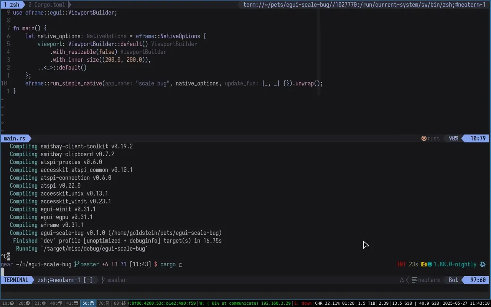

# Debugging egui on Wayland

I’m currently working on a project that requires me to write a GUI app.
egui is generally a pleasure to work with, at least for simple cases,
so I went with it. To start, I needed a fixed-size window: for various reasons,
making my app flexible-size didn’t make much sense.
I used eframe (egui’s standalone backend) to create one:

```rust
let native_options = eframe::NativeOptions {
    viewport: ViewportBuilder::default()
        // I want a fixed-size window:
        .with_resizable(false)
        // Of this particular size:
        .with_inner_size((200., 200.)),
        // And I don't care about the rest:
        ..<_>::default()
};
eframe::run_simple_native("simple window", native_options, |ctx, frame| {
    /* ... */
});
```

To check that the window I got is truly non-resizeable, I dragged one of its borders with my cursor.
I was pretty surprised when suddenly the window size jumped to be twice as large:



What gives?

## It's always scaling

I have a high-ish DPI screen, so my display is configured to use 2x scaling
(I’d use 1.5x instead, but fractional scaling is very broken).
A window jumping to 2x the size looks suspiciously like *logical pixels* (pixels before scaling)
getting confused with *physical pixels* (pixels after scaling).
It’s worth noting that egui uses logical pixels everywhere in its API,
so we requested a 200x200 logical or 400x400 physical pixels sized window.
By printing `ctx.screen_rect()` we can observe what (logical) size we actually got:

```
# before trying to resize
[src/main.rs:17:9] ctx.screen_rect() = [[0.0 0.0] - [200.0 200.0]]
# after trying to resize
[src/main.rs:17:9] ctx.screen_rect() = [[0.0 0.0] - [400.0 400.0]]
```

So our working hypothesis is as follows: the size is initially set correctly as 200x200 logical pixels
(so 400x400 physical pixels). These 400x400 physical pixels then get misinterpreted as 400x400 *logical*
pixels and scaled again to 800x800 physical pixels.

To verify our assumption, let’s check this with some more scale factors:

| Scale factor | screen_rect after resize attempt |
|:------------:|:----------------:|
|      0.5     |        200       |
|       1      |        200       |
|      1.5     |        400       |
|       2      |        400       |
|      2.5     |        600       |
|       3      |        600       |

This might *seem* like it disproves our theory (the actual size change is not `old * scale`, but `old * scale.ceil()`),
but this actually has a simple explanation. You see, Wayland has two mostly independent scale factors:
integer scaling, which is a part of the [core Wayland protocol][integer-scaling], and fractional scaling, which
is specified by the [fractional-scale-v1] protocol. It seems like whichever code confused logical and physical pixels here
just used the integer scale factor to do the confusing, which is always `scale.ceil()` on Sway.

[integer-scaling]: https://wayland.app/protocols/wayland#wl_surface:request:set_buffer_scale
[fractional-scale-v1]: https://wayland.app/protocols/fractional-scale-v1

## The confuserrrrr

Now that we have a theory on what happens, we need to hunt down the code that actually has this bug.
GUI on Wayland is a complex beast. Our simple app uses four primary components:
- winit manages communication with Wayland. It creates a window and passes a raw handle to us so we can draw our GUI;
- wgpu does low-level drawing;
- eframe uses these two to create a window and draw to it;
- and egui provides a library of UI components, which we didn’t really use here.

To find out which part is responsible for the bug, we can try going down the stack until we find the source of this
“400 logical pixels / 800 physical pixels” number. As the issue reproduces when we try to resize our window,
let’s add a [debug print] in eframe’s resize handler:

```rust
winit::event::WindowEvent::Resized(physical_size) => {
    eprintln!("got WindowEvent::Resized({physical_size:?}");
    /* ... */
}
```
([permalink](https://github.com/emilk/egui/blob/da67465a6cd00e6c1732ecb96e0febc917d63c31/crates/eframe/src/native/wgpu_integration.rs#L783)

Doing that gives us the following result:

```
got WindowEvent::Resized(PhysicalSize { width: 200, height: 200 }
got WindowEvent::Resized(PhysicalSize { width: 400, height: 400 }
got WindowEvent::Resized(PhysicalSize { width: 400, height: 400 }
# I start dragging here
got WindowEvent::Resized(PhysicalSize { width: 800, height: 800 }
```

At first, window starts out being 200x200 physical pixels. This might seem weird, but it’s somewhat understandable:
Wayland is async, so we don’t actually know the scale factor at the beginning. Then we get a resize to 400x400,
which also makes sense. When we start dragging, though, we get the 800x800px resize, which doesn’t make any sense
and seems to prove that eframe is not to blame here: it just resizes our window to the size it got from winit.

I’ll spare you some chasing through winit’s source code: there’s nothing there, it just gets the incorrect size
from the Wayland compositor. We can actually dump communication with the Wayland compositor by setting `WAYLAND_DEBUG=1`.
We can see that sway sends us an `xdg_toplevel.configure` event with size set to 400x400:

```
[ 202635.627] xdg_toplevel#29.configure(400, 400, array[8])
```

By [chasing][xdg-toplevel-configure] through some [docs][xdg-surface-set-window-geometry] we can learn that
these sizes are in “surface-local coordinate space”, which is [Wayland-speak for “logical pixels”][wl-surface].

(At this point I could actually find the issue already by reading the `WAYLAND_DEBUG` logs more carefully,
but there was *a lot* of logs, so I did things the hard way)

It seemed like the blame improbably laid with the compositor: winit got an incorrect resize and just passed it along.

[debug print]: https://buttondown.com/geoffreylitt/archive/starting-this-newsletter-print-debugging-byoc/
[xdg-toplevel-configure]: https://wayland.app/protocols/xdg-shell#xdg_toplevel:event:configure
[xdg-surface-set-window-geometry]: https://wayland.app/protocols/xdg-shell#xdg_surface:request:set_window_geometry
[wl-surface]: https://wayland.freedesktop.org/docs/html/apa.html#protocol-spec-wl_surface

## `gdb sway`; or: how did we get there?..

One of my favourite features of Wayland is that you can actually run a compositor inside a window,
nested in another Wayland session. This simplifies debugging greatly, since I can easily attach a debugger
to the compositor without messing up the rest of my graphical session.
(Well, this actually messes up XDG portals, but, like, it almost works).
As the issue manifests when we try to resize a floating window, the most logical place to look
is the code that handles mouse movement during a window resize:
[`handle_pointer_motion` in `seatop_resize_floating.c`][sway-resize-code].
By doing a lot of stepping in the debugger and printing all the variables I learned that the offending values were flowing from [the `view_get_constraints()` function][view-get-constraints]:

```c
view_get_constraints(con->view, &view_min_width, &view_max_width,
				&view_min_height, &view_max_height);
printf("view_get_constraints(_, %lf, %lf, %lf, %lf)\n", view_min_width, view_max_width, view_min_height, view_max_height);
```

It seemed like both min and max window size was set to 400 (logical) pixels. On trying to resize, sway noticed that the window is actually smaller than its minimal size and instantly snapped it to match the constraints. But how did this size get there? Well, by looking at the `WAYLAND_DEBUG` again, we can see that we explicitly asked sway to do so at the very beginning!

```
[ 198973.131]  -> xdg_toplevel#29.set_min_size(400, 400)
[ 198973.135]  -> xdg_toplevel#29.set_max_size(400, 400)
```

## Back in Rust land

Knowing what you’re actually looking for is a life saver when you’re trying to understand where the data is coming from.
We can quite easily determine that our `.set_{min,max}_size()` calls are happening in `.set_resizeable(false)`:

```rust
self.set_min_inner_size(Some(self.size));
self.set_max_inner_size(Some(self.size));
```
([permalink](https://github.com/rust-windowing/winit/blob/9cbce055d35d1270e7e4cc43ba4c81fffa6d1bb9/src/platform_impl/linux/wayland/window/state.rs#L513-L514))

and `self.size` is previously set from `WindowState::new()` *by explicitly confusing physical and logical pixels*:

```rust
Self {
    /* ... */
    size: initial_size.to_logical(1.),
    //           sic! ^^^^^^^^^^^^↑↑^
    //                            that’s a scale factor!
    stateless_size: initial_size.to_logical(1.),
    /* ... */
}
```
([permalink](https://github.com/rust-windowing/winit/blob/9cbce055d35d1270e7e4cc43ba4c81fffa6d1bb9/src/platform_impl/linux/wayland/window/state.rs#L212-L213))

This felt to me as a winit bug, so I opened an issue: https://github.com/rust-windowing/winit/issues/4266.

After a bit of back-and-forth, we established that:
1. winit doesn’t really like when you pass physical sizes, since Wayland works mostly with logical sizes;
2. There’s no good way to convert physical size back to logical size due to Wayland scale factor being communicated asynchronously;
3. We *could* react to a resize event by setting min/max sizes again, but
   1. sway doesn’t really like it when you change min/max sizes in runtime, and
   2. winit doesn’t currently provide a good way to do that anyway.

It seemed like the root of the issue was with eframe after all: I specified the window size in logical pixels, so why was it converted to physical?

## Getting logical

eframe converts logical pixels (actually, logical *points*: egui has its own scale factor that’s multiplied with native scale factor)
to physical pixels in `create_winit_window_attributes()`. To do that, it guesses native scale factor by looking at the scale factor of the primary display:

```rust
// We set sizes and positions in egui:s own ui points, which depends on the egui
// zoom_factor and the native pixels per point, so we need to know that here.
// We don't know what monitor the window will appear on though, but
// we'll try to fix that after the window is created in the call to `apply_viewport_builder_to_window`.
let native_pixels_per_point = event_loop
    .primary_monitor()
    .or_else(|| event_loop.available_monitors().next())
    .map_or_else(
        || {
            log::debug!("Failed to find a monitor - assuming native_pixels_per_point of 1.0");
            1.0
        },
        |m| m.scale_factor() as f32,
    );
let zoom_factor = egui_ctx.zoom_factor();
let pixels_per_point = zoom_factor * native_pixels_per_point;
```
([permalink](https://github.com/emilk/egui/blob/92fea8a18fe6c102a6879347cbd599f3daf163aa/crates/egui-winit/src/lib.rs#L1581-L1596))

and then uses this scale factor to set the *physical* size of the window:

```rust
if let Some(size) = inner_size { 
     window_attributes = window_attributes.with_inner_size(PhysicalSize::new( 
         pixels_per_point * size.x, 
         pixels_per_point * size.y, 
     )); 
 } 
```
([permalink](https://github.com/emilk/egui/blob/92fea8a18fe6c102a6879347cbd599f3daf163aa/crates/egui-winit/src/lib.rs#L1674-L1679))

(Interestingly, that explains why we got a resize depending on the *integer* scale:
there’s no (portable) way to get the fractional scale of a monitor in Wayland.)

Knowing that, the actual fix is easy: given that winit wants logical size here,
we just need to stop guessing the native scale factor and pass a logical size instead.
Doing that uncovered something funny: egui uses clippy to ban `LogicalSize` from its code
because egui’s logical size is not the same as winit’s logical size due to the zoom factor.
Anyway, I just disabled that lint and it worked.

[My PR] was accepted, the issue is fixed in eframe 0.32.0 and I can return to writing my GUI app.

A bit later [waffle] and I found another, completely unrelated [Wayland-scaling-and-Rust-GUI-related bug][gpui-bug],
along with a bug in our actual, physical laptop displays — but that’s a story for another time.

[sway-resize-code]: https://github.com/swaywm/sway/blob/c2f08075ec00632293bbc63582c7f3ffd75441af/sway/input/seatop_resize_floating.c#L35
[view-get-constraints]: https://github.com/swaywm/sway/blob/c2f08075ec00632293bbc63582c7f3ffd75441af/sway/input/seatop_resize_floating.c#L93
[My PR]: https://github.com/emilk/egui/pull/7103
[gpui-bug]: https://github.com/zed-industries/zed/pull/31836
[waffle]: https://github.com/WaffleLapkin

## Takeaways

1. Wayland’s scaling story is a mess.
2. While dealing with this mess, you should avoid using physical sizes if possible.
3. Carefully reading logs before jumping into debugger can save a lot of time.
